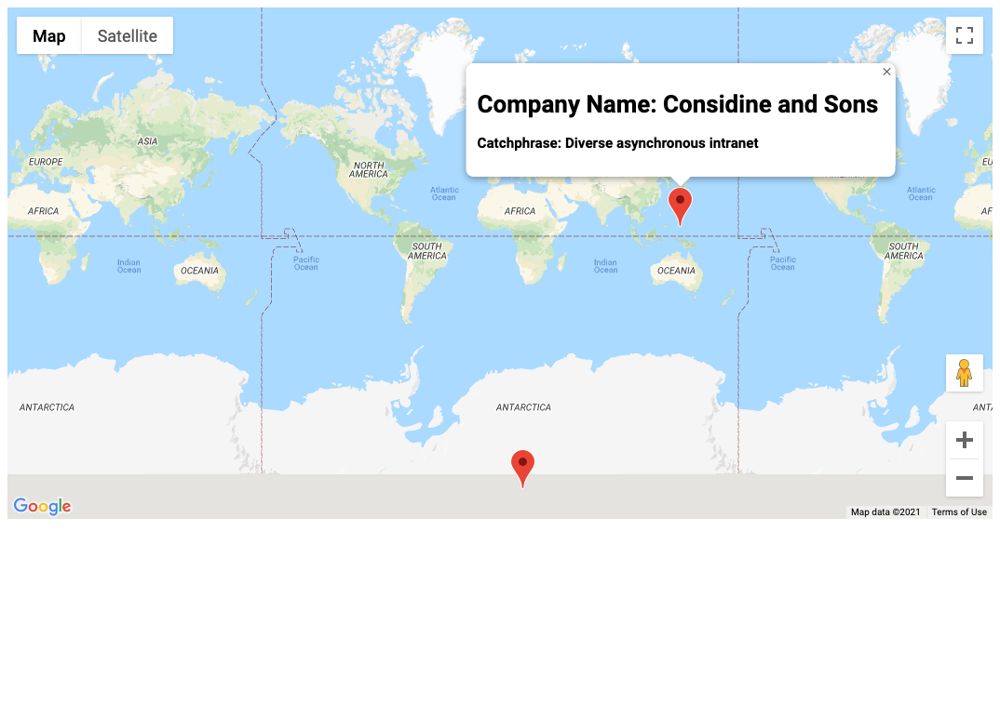

# typescript-maps

A map generateed by random user and company data using typescript and parcel-bundler

## Table of contents

- [General info](#general-info)
- [Technologies](#technologies)
- [Install](#install)

## General info

This application illustrates how Google Maps API can be integrated into a project relatively easily with TypeScript. Faker was used to generate a user and a company. Methods include Marker and InfoWindow.

## Technologies

Project is created with:

- TypeScript
- Node
- Parcel-Bundler
- Faker
- Google Maps API

## Install

To install locally, download the repository. Make sure you have node.js installed. Replace the the Google Maps API key in index.html line 12 with on you generate from the Google Developers Console. Open your terminal and run

`npm install`

To start the application

` parcel index.html`

